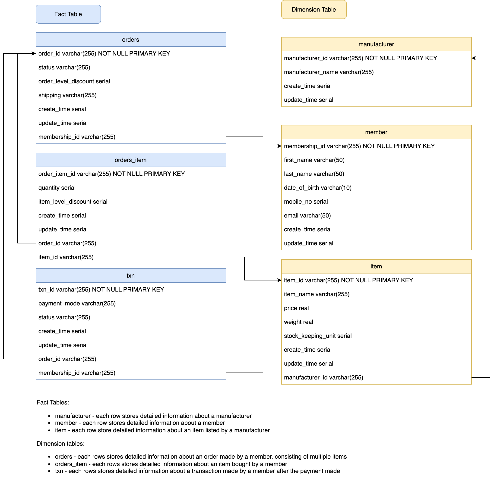

# Data Engineer Tech Challenge

The repository is created as a submission request to the data engineer technical
challenge ([link](https://github.com/ameeraadam/Data-Engineer-Tech-Challenge)).

## 1. Prerequisite

Docker is installed

## 2. Directory Tree

The following is the directory tree

```
.
├── Pipfile
├── Pipfile.lock
├── ReadMe.md
├── docker
│   ├── section1_dockerfile
│   ├── section2_dockerfile
│   ├── section4_postgres_dockerfile
│   └── section4_python_dockerfile
├── project-data-engineer-tech-challenge.iml
├── section1
│   ├── __init__.py
│   ├── __pycache__
│   │   ├── __init__.cpython-38.pyc
│   │   ├── config.cpython-38.pyc
│   │   └── main.cpython-38.pyc
│   ├── conf
│   │   ├── section1_process.yaml
│   │   ├── section1_python.ini
│   │   └── section1_test_config.yaml
│   ├── config.py
│   ├── main.py
│   ├── operator
│   │   ├── __init__.py
│   │   ├── __pycache__
│   │   │   ├── __init__.cpython-38.pyc
│   │   │   └── spark_operator.cpython-38.pyc
│   │   └── spark_operator.py
│   ├── resource
│   │   ├── dest
│   │   │   ├── successful_application
│   │   │   │   ├── _SUCCESS
│   │   │   │   └── part-00000-795a7ab7-add8-4407-81b1-004e3988d480-c000.csv
│   │   │   └── unsuccessful_application
│   │   │       ├── _SUCCESS
│   │   │       └── part-00000-b28df8de-ca05-4e22-85b3-70a994714271-c000.csv
│   │   └── src
│   │       └── application
│   │           ├── applications_dataset_1.csv
│   │           └── applications_dataset_2.csv
│   ├── test
│   │   ├── __init__.py
│   │   └── test_config_reader.py
│   └── util
│       ├── __init__.py
│       ├── __pycache__
│       │   ├── __init__.cpython-38.pyc
│       │   ├── config_reader.cpython-38.pyc
│       │   ├── logger.cpython-38.pyc
│       │   └── path_finder.cpython-38.pyc
│       ├── config_reader.py
│       ├── logger.py
│       └── path_finder.py
├── section1_manage.py
├── section1_runner.sh
├── section2
│   ├── conf
│   │   ├── section2_create.sql
│   │   ├── section2_postgresql.ini
│   │   ├── section2_query_top10_highest_spending_member.sql
│   │   └── section2_query_top3_most_sold_item.sql
│   └── section2_entity_diagram.png
├── section2_runner.sh
├── section3
│   ├── section3_read_architecture.png
│   └── section3_write_architecture.png
├── section4
│   ├── __init__.py
│   ├── __pycache__
│   │   ├── __init__.cpython-38.pyc
│   │   ├── config.cpython-38.pyc
│   │   └── main.cpython-38.pyc
│   ├── conf
│   │   ├── section4_create.sql
│   │   ├── section4_grafana.ini
│   │   ├── section4_postgresql.ini
│   │   ├── section4_process.yaml
│   │   └── section4_python.ini
│   ├── config.py
│   ├── covid19_graph.png
│   ├── grafana
│   │   ├── covid_dashboard.json
│   │   ├── postgres_datasource.json
│   │   └── postgres_datasource_template.json
│   ├── main.py
│   ├── operator
│   │   ├── __init__.py
│   │   ├── __pycache__
│   │   │   ├── __init__.cpython-38.pyc
│   │   │   └── postgresql_operator.cpython-38.pyc
│   │   └── postgresql_operator.py
│   └── util
│       ├── __init__.py
│       ├── __pycache__
│       │   ├── __init__.cpython-38.pyc
│       │   ├── config_reader.cpython-38.pyc
│       │   ├── logger.cpython-38.pyc
│       │   └── path_finder.cpython-38.pyc
│       ├── config_reader.py
│       ├── logger.py
│       └── path_finder.py
├── section4_manage.py
├── section4_runner.sh
└── section5
    ├── car_buy_price_prediction.html
    ├── car_buy_price_prediction.ipynb
    └── resource
        └── ml
            └── car.data
```

* 'Pipfile' contain Python package requirements which is commonly used in all sections
* 'docker' folder contains Dockerfile created for all sections
* 'section1_runner.sh', 'section2_runner.sh', 'section4_runner.sh' are the bash script used to build the docker images,
  set up the docker containers and execute the pipeline accordingly
* 'section1_manage.py' and 'section4_manage.py' are the entrypoint to the Python job in section 1 and 4.
* In each section folder (eg. 'section1'), the job/ docker configuration files are saved in 'conf' folder while data
  used is saved in 'resource' folder. Also, the image results of each section are saved in the respective section
  folder.

## 3. Section 1: Data Pipelines

In this section, a data pipeline is designed and implemented to process the membership applications submitted by users
on an hourly interval basis. The design requirements are as such:

* The job to be run on hourly basis
* The data should be processed to the required format.
* The successful and unsuccessful application should be saved to two separate folders.
* The pipeline should be easy to scaled.

Before any design, the following assumptions are made:

* The source CSV folder will always get overwritten with the latest source CSV file.

### 3.1. Design of Data Processing

In view of the requirements and potential increase in ecommerce data volume, the multi-processing is considered to allow
quick process. In this project, Spark is adopted due to the following:

* by nature a multiprocessing engine, minimum effort in running a parallel process
* can be standalone or used across different machines, the coordination between machines is handled by Spark. Minimal
  code change if deploy codes onto multiple machines as compared to Pandas
* View can be created from different sources and SQL can be easily defined to process the data
* Process execution plan is available which can be used to easily identify logic needs to be optimized

Since the job is relatively simple and has no other dependencies, it is scheduled by a cronjob for an hourly basis

### 3.2. Command

Go to project root folder first.
To setup the Docker containers

```
sh section1_runner.sh start
```

To test run the pipeline

```
docker container exec section1_python bash -c 'python3 section1_manage.py --task-config section1_process.yaml'
```

To view the hourly cronjob

```
docker container exec -it section1_python bash

# In the container
crontab -l
```

```
0 * * * * python3 section1_manage.py --task-config section1_process.yaml >> section1/log/data_pipeline.log 2>&1
```

To view the hourly cronjob log

```
cat section1/log/data_pipeline.log
```

To take down the Docker containers

```
sh section1_runner.sh stop
```

The path to the output of the processing pipeline is as follows:

```
section1/resource/dest
```

## 4. Section 2: Databases

In this section, a database infrastructure is set up for a e-commerce company's sales transactions.

### 4.1. Design of Database Table Schema

The respective tables' schema are designed as depicted:


The paths to SQL statement for the below tasks are as follows:

* Which are the top 10 members by spending

```
section2/conf/section2_query_top10_highest_spending_member.sql
```

* Which are the top 3 items that are frequently brought by members

```
section2/conf/section2_query_top3_most_sold_item.sql
```

### 4.2. Command

Go to project root folder first.
To setup the Docker containers

```
sh section2_runner.sh start
```

To access the PostgreSQL Docker container

```
docker container exec -it section2_postgresql bash

# Run the command and enter password
psql -U postgres -W my_database
my_password
```

To take down the Docker containers

```
sh section2_runner.sh stop
```

## 5. Section 3: System Design

In this section, a data infrastructure on the cloud is designed for a company whose main business is in processing
images

### 5.1. Design of System Architecuture

Architecture for read request


Architecture for write request


## 6. Section 4: Charts & APIs

In this section, a dashboard is designed to display the statistic of COVID19 cases in Singapore.

The data is retrieved
from [link](https://documenter.getpostman.com/view/10808728/SzS8rjbc#b07f97ba-24f4-4ebe-ad71-97fa35f3b683) and processed
and saved in a Dockerized PostgreSQL database. The data is then read from a Dockerized Grafana Dashboard which is
accessible from `http://localhost:3001/dashboard/db/covid?orgId=1` with username and password both `admin`


### 6.1. Command

Go to project root folder first.
To setup the Docker containers

```
sh section4_runner.sh start
```

To take down the Docker containers

```
sh section4_runner.sh stop
```

## 7. Section 5: Machine Learning

In this section, a machine learning model is created with the data
from [link](https://archive.ics.uci.edu/ml/datasets/Car+Evaluation) to predict the buying price given the parameters.

From the preview of the data, it is found that:

* all the features and labels are categorical
* the features `maintenance`, `number_of_doors`, `lug_boot_size` and `safety` has almost no correlation with the
  label `buying_price`

In view of the finding from data preview, data pre-processing is performed by first converting the categorical columns
to respective numerical values. Two sets of data set are created based on different features - a set with all features
and a set with only `class_value`.

The performance of two models - multinomial logistic regression and gradient boosting with different data sets are
compared. The gradient boosting with single feature data set performs the best and is used to make prediction. 
